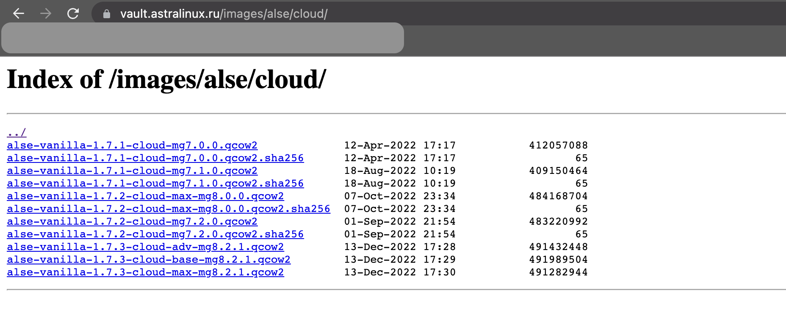
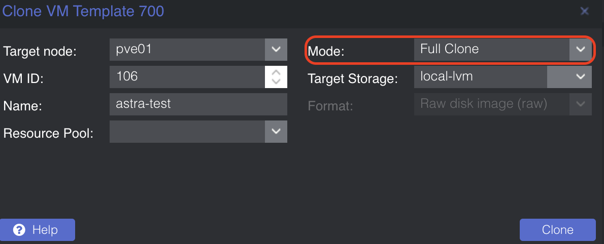
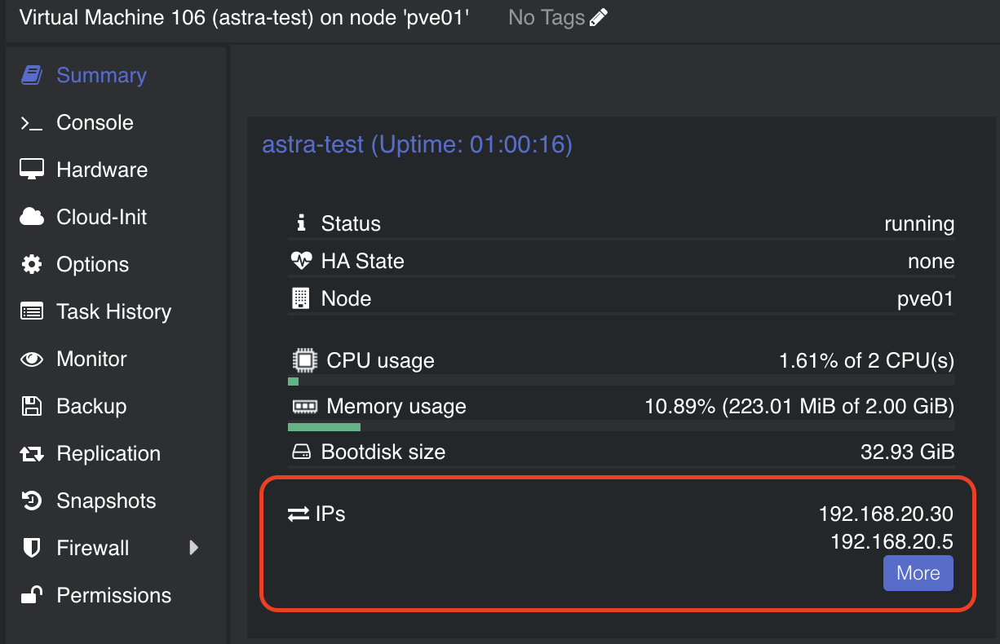
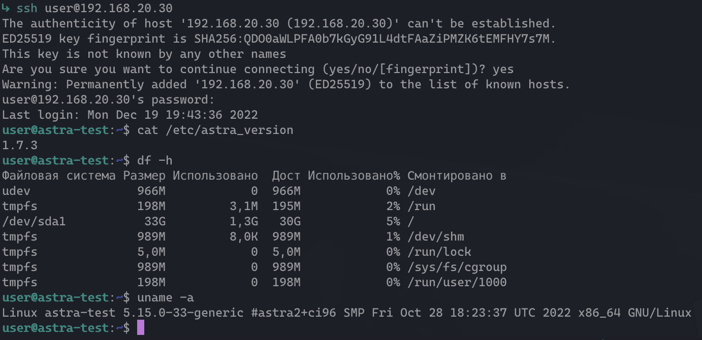

## Что такое cloud-init образы и зачем они нужны

Вы когда-нибудь задумывались над тем, как вы создаете виртуальные машины?
Классический и самый банальный способ создания виртуальной машины (VM):

1. Создать VM в гипервизоре
2. Сконфигурировать параметры VM
3. Примонтировать ISO-образ ОС, которую нужно установить на VM
4. Запустить VM и установить ОС с ISO-образа
5. Для упрощения будущей жизни, можно создать из данной VM шаблон (template)

Как правило, это долгий и скучный процесс, богатый ручной работой. Конечно, можно использовать Packer, но время установки это сократит лишь чуть-чуть.
При таком подходе, создание кластера из нескольких одинаковых VM может затянуться на долгое время, только из-за установки хостовой ОС.

Сейчас нас окружает мир облачных технологий, когда вы покупаете VM у одного из клауд-провайдеров, где все происходит быстро:

1. Ввели имя пользователя, которого необходимо создать при инициализации VM
2. Пароль или публичный ключ от создаваемого пользователя
3. Нажали на кнопку "Создать"
4. Вуаля! VM готова к работе! Без какой-либо установки и ручной конфигурации пользователя!

Вот для этого и были придуманы cloud-init образы. Сloud-init это программа для инициализации виртуальных машин, обычно применяющаяся в облачных платформах. Но использовать cloud-init можно и локально, например в Proxmox, который успешно поддерживает данную технологию.
Все что нам надо - cloud-init образ нужной ОС. Данная статья применима для любого cloud-init образа. Я покажу, как это делать на примере Astra Linux 1.7

## План работы

1. Качаем cloud образ Astra Linux 1.7 (можно создать самому, с использованием cloud-init, но это тема другой статьи)
2. Создаем VM в Proxmox используя скачанный образ
3. Конвертируем собранную VM в шаблон (template)
4. Клонируем из шаблона полноценную VM
5. Инициализируем VM через cloud-init

## Качаем cloud образ Astra Linux 1.7

Интересующие нас образы я брал [отсюда](https://vault.astralinux.ru/images/alse/cloud/).



Заходим по ssh на наш Proxmox и качаем нужный нам образ, в моем случае - `alse-vanilla-1.7.3-cloud-max-mg8.2.1.qcow2`

```shell
wget alse-vanilla-1.7.3-cloud-max-mg8.2.1.qcow2
```

## Создаем VM в Proxmox используя скачанный образ

```shell
qm create 700 --name "alse-vanilla-1-7-3-cloudinit-max-template" --memory 2048 --cores 2 --net0 virtio,bridge=vmbr0
qm importdisk 700 alse-vanilla-1.7.3-cloud-max-mg8.2.1.qcow2 local-lvm
qm set 700 --scsihw virtio-scsi-pci --scsi0 local-lvm:vm-700-disk-0
qm set 700 --boot c --bootdisk scsi0
qm set 700 --ide2 local-lvm:cloudinit
qm set 700 --serial0 socket --vga serial0
qm set 700 --agent enabled=1
```

Знакомых с синтаксисом управления Proxmox данные строчки удивить не должны.
Для начинающих поясню. В примере создается виртуальная машина с VMID=700 (можно указать любой, это просто идентификатор вашей VM), 2Gb RAM, 2 ядрами CPU, соответствующим сетевым интерфейсом.
Затем мы импортируем скачанный нами cloud образ Астры в локальное хранилище Proxmox и подключаем как диск к созданной VM. После этого подключаем cloud-init хранилище, для последующей инициализации.

Вы можете использовать любые нужные вам настройки или настраивать все в GUI. Все что надо - подключить диск со скачанным образом и cloud-init хранилище.

## Конвертируем собранную VM в шаблон (template)

После всех подготовительных мероприятий создаем шаблон нашей ОС.

```shell
qm template 700
```

Шаблон готов!

[template](images/pmg_template.png)

## Клонируем из шаблона полноценную VM

Шаблоны нужны нам для клонирования VM, поэтому нажимаем ПКМ на созданном темплейте и выставляем мод "Full Clone".
Назвал я свою VM `astra-test`, вы можете как угодно обозвать.



Нажимаем "Clone" и дожидаемся окончания клонирования.

## Инициализируем VM через cloud-init

После завершения клонирования VM, можно поправить настройки "железа" и увеличить размер диска.

### Расширяем диск

Для этого в разделе `Hardware` нажимаем на Hard Disk -> Disk Action -> Resize.


Указываем нужный вам размер диска и нажимаем "Resize disk". Самое главное, что система сама займет и разметит нужное пространство при загрузке.

Теперь самое главное - переходим в раздел `Cloud-init`

### Настраиваем cloud-init

[cloud-init_configure](images/cloud-init_configure.png)

В соответствующих полях задаем нужные нам параметры, которые мы хотим создать в системе во время запуска:
- логин пользователя
- пароль пользователя
- настройки DNS
- открытый SSH ключ пользователя
- настройка сети (можно оставить DHCP, но я укажу IP-вручную)

Далее жмем "Regenerate Image".

Подготовительные мероприятия завершены, можно запускать VM для проверки!

## Запускаем и проверяем VM

После запуска VM astra-test в статистике мы видим 2 IP-адреса: один получен от моего DHCP-сервера, второй мы задали сами.
Такое бывает, можно отключить DHCP уже в самой ОС.



Пробуем подключиться по SSH к нашей VM, используя адрес и креды, которые мы указывали при настройке cloud-init в Proxmox

```shell
ssh user@192.168.20.30
```



Готово, даже hostname настроился сам, по имени виртуальной машины в Proxmox. И да, если переименовать VM, hostname изменится за вас сам.
Теперь можно натравливать свой Terraform с Ansible на данный шаблон и создавать кластеры из большого количества виртуальных машин за считанные минуты!

Надеюсь, что данная статья будет кому-то полезна, для упрощения и экономии времени на создание стендов, кластеров и т.д.