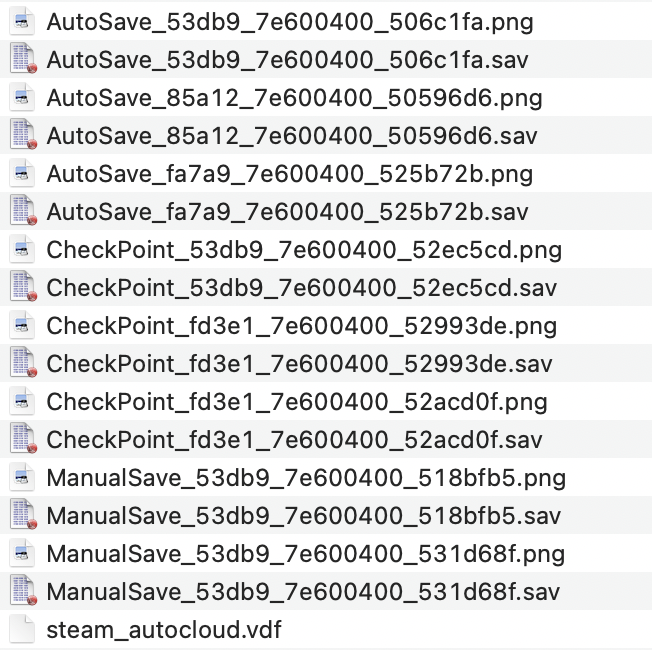
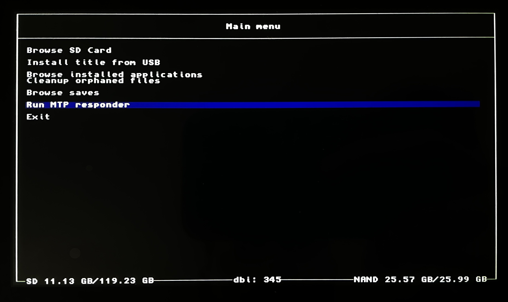
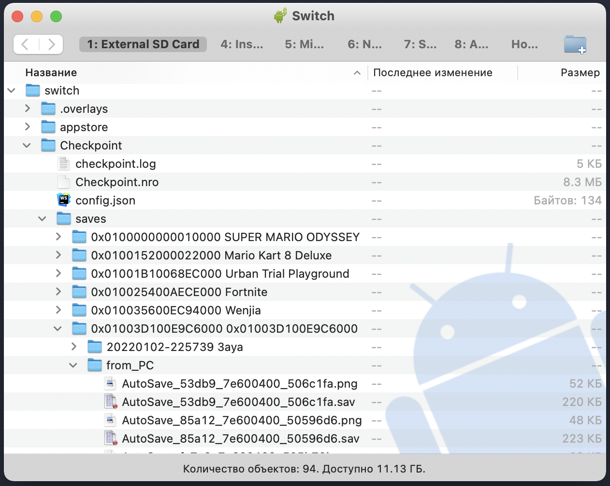

---

title: "Export Witcher 3 saves from PC to Nintendo Switch"
date: 2022-01-03T06:16:38+03:00
tags:
- switch
- nintendo
- hack
- saves
- witcher3
---

# Как использовать сохранения с PC – версии "Witcher 3 Wild Hunt" на Nintendo Switch

## Введение

Всем привет! В этой статье хочу поделиться, как я переношу свои сохранения из игры "Witcher 3 Wild Hunt" со своего PC на консоль Nintendo Switch.

Заранее хочу отметить, что знаю про возможность сетевой синхронизации Steam-версии Ведьмака. Таких статей в Интернете очень много. Однако при ~~взломе~~ консоли Вы зачастую будете блокировать все Интернет-соединения – дабы не получить заветный **бан**. Не говоря уже о том, что люди ~~могут~~ использовать версию игры не из Steam. И, соответственно, метод с облачной синхронизацией мне не подходит.

### Нам понадобится

- PC с установленной игрой (это может быть как Steam-версия, так и из ~~других источников~~)
- ~~Взломанная~~ консоль *Nintendo Switch*, с установленными *Homebrew* приложениеми – **[Checkpoint](https://github.com/FlagBrew/Checkpoint/releases)** и [**DBI**](https://github.com/rashevskyv/dbi/releases)
- Желательно USB *Type-C* кабель (думаю можно и без него – по воздуху, но я не проверял)
- Прямые руки

## Экспорт сохранений с PC

Локальные файлы сохранений на ОС Windows по-умолчанию находятся по-следующему пути:

`C:\Users\<USER_NAME>\Documents\The Witcher 3\gamesaves`

Файлы сохранений имеют следующий вид:

Скопируйте все эти файлы себе в папку для дальнейшего импорта в консоль. В моем случае – я закинул файлы в папку "*from_PC*"

## Импорт сохранений в Nintendo Switch

В качестве рабочей ОС я буду использовать *MacOS*. Действия для других ОС будут идентичными.

Заранее сделайте **бэкапы** ваших сейвов на консоли. Делается это так же в программе **[Checkpoint](https://github.com/FlagBrew/Checkpoint/releases)**, как показано [тут](https://projectpokemon.org/home/tutorials/save-editing/managing-switch-saves/using-checkpoint-r67/).

### Подключение Nintendo Switch

Подключение свитча к MacBook следует производить в заблокированном режиме. Когда свитч разблокирован – Мак почему-то начинает заряжаться от него и никакого обмена не произойдет. Чтобы этого избежать – подключайте свитч к Маку при заблокированном экране свитча.

На этом этапе нам понадобится *Homebrew* приложение – [**DBI**](https://github.com/rashevskyv/dbi/releases) на свитче и **[Android File Transfer](https://www.android.com/filetransfer/)** на Mac.

1. Подключаем заблокированный свитч к компу USB *Type-C* кабелем

2. Открываем программу *DBI* и выбираем "*Run MTP responder*"

   

3. Открываем программу *Android File Transfer*.\
   Далее необходимо найти папку с игрой в каталоге Checkpoint.\
   По-умолчанию путь: `/switch/Checkpoint/saves/<GAME_FOLDER>`\
    Не знаю почему, но у меня именно Ведьмак не отображался в явном виде, за исключением других игр. Возможно у Вас будет по-другому, но я нашел опытным путем.
   

4. Закинуть в папку из пункта выше – папку с Вашими сохранениями. В моем случае папка с сохранениями называется "*from_PC*"

5. Можно отключать свитч от компьютера

### Загрузка сохранений в игру

1. Открываем *Homebrew* приложение – *Checkpoint*
2. Переходим к нашей любимой игре и выбираем нашу папку с импортированными сейвами.
   В моем случае – это "from_PC"\
   
3. Нажимаем на свитче **правый стик (кнопка "R")** для импорта сейвов в игру и подтверждаем
4. Можно закрывать Homebrew и открывать игру

## Наслаждаемся

Как видно наши сохранения успешно импортировались в игру!

Можно использовать обратный алгоритм для экспорта сохранений со свитча и импорта их в ПК.

Надеюсь, что эта статья будет кому-нибудь полезна :)

